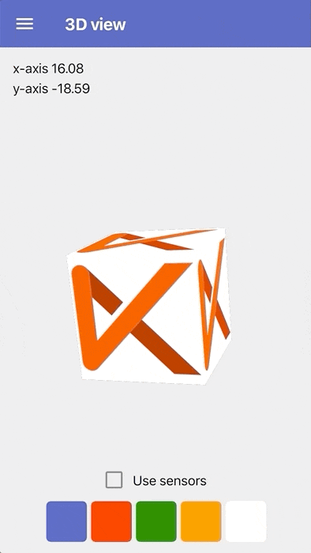
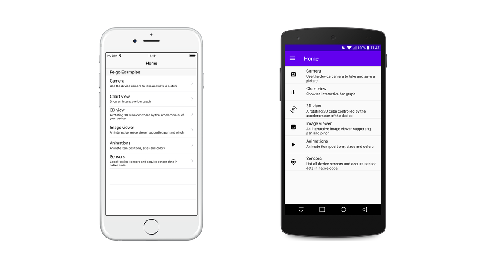
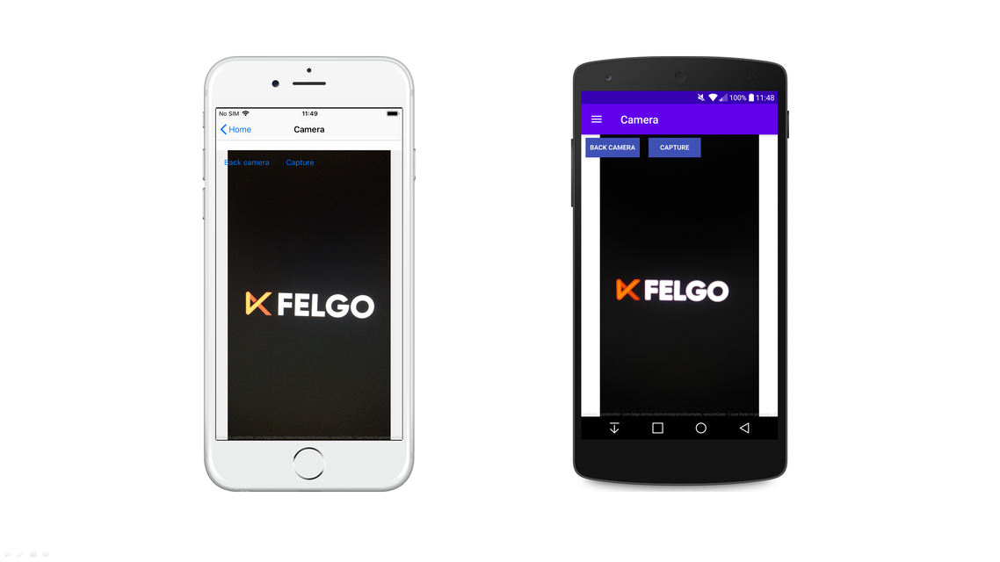
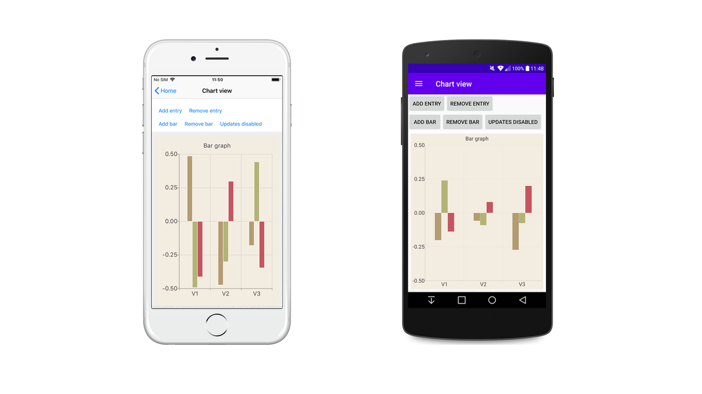
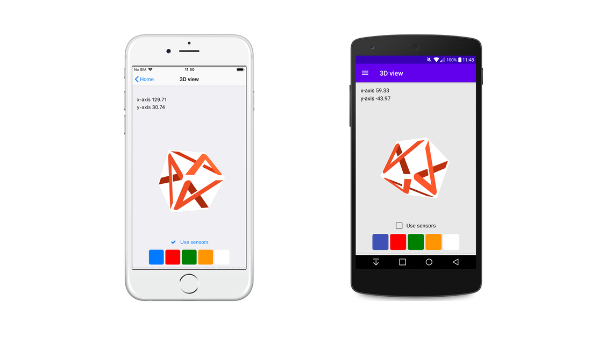
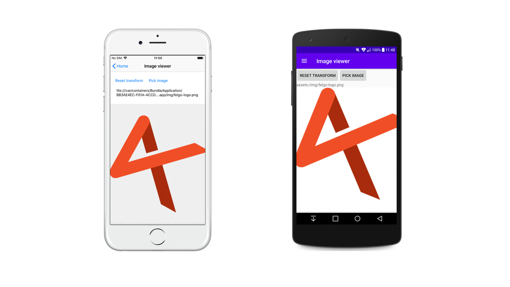
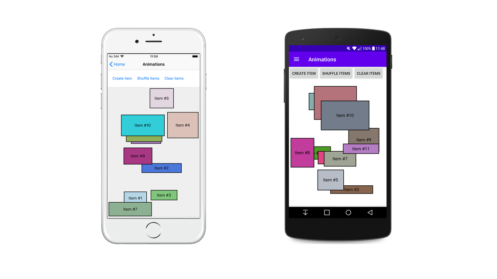
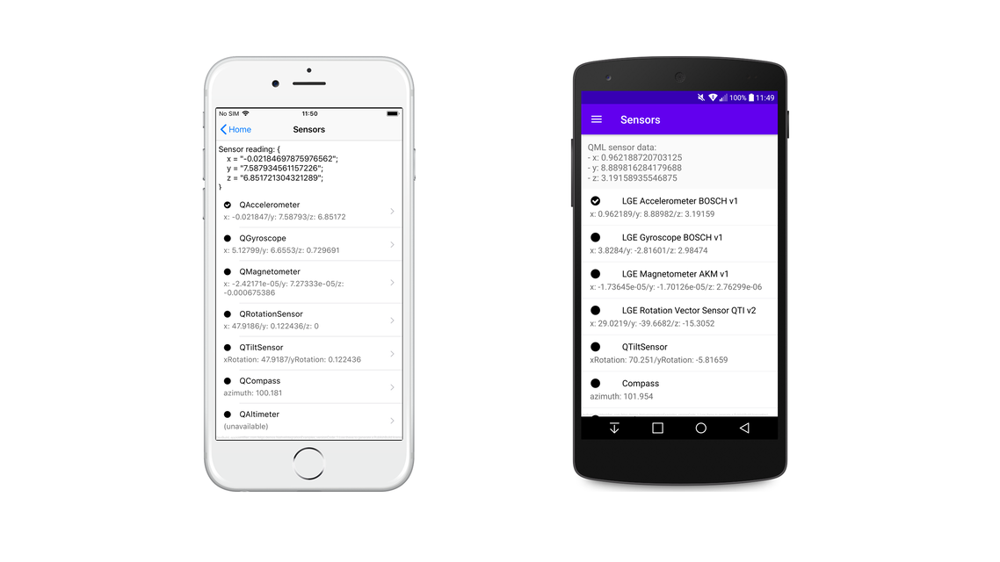

# Integrate Felgo & Qt in Existing iOS or Android Apps

Features like 3D Scenes, Custom UI or Visual Effects are hard to create natively with Android Studio or Apple Xcode.
Save time and effort by using **Felgo Native App Integration** for rich experiences with 3D content, shaders, graphical effects, charts, multimedia, custom controls, gamification features or unique animations.

For detailed explanations see [How to Add Smooth Animations, 3D, Charts or Mini-Games with a Custom Qt View in Xcode or Android Studio](https://blog.felgo.com/updates/release-3.7.0-android-ios-qt-native-app-integration-for-animations-3d-charts-games).




# Native App Integration: Embed Felgo in Your iOS or Android App

With Native App Integration, you can embed app views developed with the Felgo SDK into your existing mobile app. Felgo extends Qt, runs cross-platform, and offers many features, for example:

- **Custom UI and Visual Effects**: No complex low level operations needed to create awesome UIs and animations. You can also work with charts, apply filter effects or render 3D content.

- **Sensors, File Downloads and Backend Services**:  Felgo makes working with sensors, loading assets at runtime, or integrating backend services easy. You can also test your cross-platform code standalone before running it in your native app.

- **2D Game Engine and Gamification**: Use C++ based 2D physics with high performance gaming components, or integrate leaderboard or multiplayer services in your native app.

Using Felgo for your native iOS or Android app opens up a whole new world of possibilities. You can find a list of most relevant use-cases and some technical background in the sections below.

To add such features, you can simply run Felgo in an own view of your native iOS or Android app. Native App Integration allows you to:
- **Save Development Time**: Felgo is a cross-platform tool that supports both Android, iOS, as well as Desktop or Embedded platforms. Save time by developing features only once for all platforms. You can also use Felgo tools like QML Hot Reload to e.g. instantly test your code on different devices and platforms.

- **Keep Existing Code**: Only move parts of your project to Felgo. You can develop new features with Felgo, while keeping your existing code.

- **Transition to Cross-Platform**: Replace old application code and migrate to cross-platform development step-by-step.


# Felgo Add-to-App examples

This repository contains several example projects showcasing how to integrate Felgo to your native app.
The [Felgo SDK](https://felgo.com/) can also be used stand-alone.

You can read more about Native App Integration at the [official Felgo documentation](https://felgo.com/doc/felgo-native-integration/).


# Building and running

## Android

Open `android` folder in Android Studio, build & run on your device or emulator.

## iOS

### Cocoapods

The iOS project requires Cocoapods. You can install them with the following command:

```
sudo gem install cocoapods
```

For more info see the Cocoapods page: https://guides.cocoapods.org/using/getting-started.html

### Setup

Run `pod install` in `ios` folder. Open the generated `NativeIntegrationExamples.xcworkspace` in Xcode, build & run on your device or emulator.


# Examples

The example app contains multiple QML example showcases. Each demonstrates a potential use-case for Felgo and QML in a native app.

Each example is a view in the native app's navigation. 



On Android, each example is a `FelgoAndroidFragment` and shown in the navigation drawer.  

On iOS, each example is a `ViewController` that contains a `FelgoIOSView` and shown in the `UINavigationController`. 

Most examples are implemented using Java on Android and Objective C on iOS. 
Felgo can also be added using Kotlin and Swift code, as demonstrated in the Chart view example.

## Camera 

Uses the [QML Camera](https://felgo.com/doc/qt/qml-qtmultimedia-camera/) to take and save a picture.

The app can use that stored picture file in native code.



## Chart view 

Uses the [QML ChartView](https://felgo.com/doc/qt/qml-qtcharts-chartview/) to visualize interactive data provided by the native application.

This example is implemented using Kotlin on Android and Swift on iOS.



## 3D view

Uses the [QML 3D engine](https://felgo.com/doc/qt/qt3d-core-qmlmodule/) to show 3D content.

Uses the [QML sensors API](https://felgo.com/doc/qt/qtsensors-qmlmodule/) to interact with the 3D scene.



## Image viewer

Shows an interactive image view. 

Uses the [QML PinchArea](https://felgo.com/doc/qt/qml-qtquick-pincharea/) to add simple pinch-to-zoom and pan interaction.

The native app can provide the image for QML using native gallery selection.



## Animations

Showcases some uses of the [QML animation framework](https://felgo.com/doc/qt/qml-qtquick-animation/).



## Sensors

Uses the [QML sensors API](https://felgo.com/doc/qt/qtsensors-qmlmodule/) to obtain data from all device sensors in the native app.


